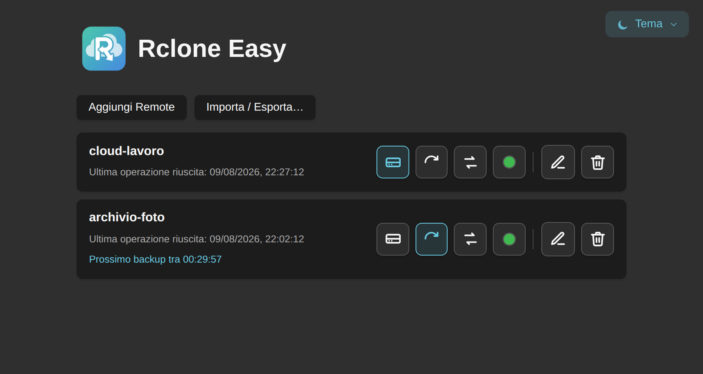
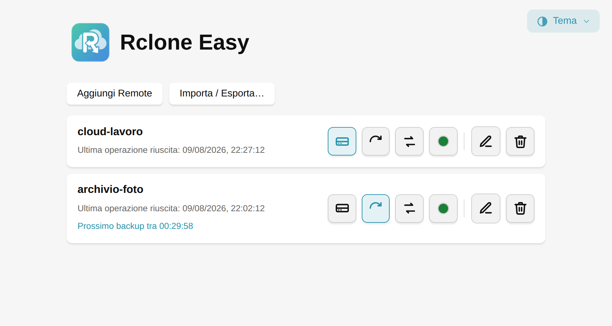

<div align="center">
  
  
</div>

# Rclone Easy

**Un'interfaccia grafica semplice per [rclone](https://rclone.org/)** — pensata come alternativa più leggera a client come Insync, Google Drive Sync o MEGAsync, ma capace di collegarsi a decine di provider cloud diversi (S3 e compatibili, Backblaze B2, MEGA, Google Drive, Dropbox, OneDrive...) grazie al motore di rclone che lavora dietro le quinte.

Costruita con [Tauri 2](https://tauri.app/) (Rust) + [SvelteKit](https://kit.svelte.dev/) (Svelte 5).

> [!WARNING]
> **Progetto sperimentale, in sviluppo attivo.** Non è ancora stato sottoposto a un uso estensivo su larga scala e potrebbe contenere bug, anche seri. **Fai sempre un backup dei tuoi file prima di usare l'app** per mount, backup o sincronizzazioni — soprattutto la prima volta che la usi con dati importanti. Usala a tuo rischio.

## Cosa fa

- **Mount**: collega un remote cloud come se fosse una cartella locale.
- **Backup**: sincronizzazione in una sola direzione (locale → cloud o viceversa), con protezione di default contro cancellazioni accidentali sulla destinazione.
- **Sincronizzazione bidirezionale**: tiene allineate due cartelle (locale e remota) in entrambe le direzioni, con gestione esplicita dei conflitti e un blocco di sicurezza (con log dettagliato consultabile dall'app) se rileva una cancellazione di massa anomala.
- **Automazione**: ogni backup/sincronizzazione può girare da solo a intervalli regolari, senza bisogno di cron o systemd timer.
- **Icona nella tray**: stato a colpo d'occhio (in corso / ultimo errore), menu rapido per montare/smontare e avviare i job direttamente da lì.
- **Backup/ripristino cifrato**: il file di backup esportato è protetto da una password scelta da te, quindi può essere spostato/salvato altrove senza esporre le credenziali dei tuoi remote. (La configurazione live sul disco locale segue invece il comportamento nativo di rclone — vedi l'avviso sulla sicurezza qui sotto.)
- **Password opzionale per la configurazione**: se preferisci, puoi proteggere `rclone.conf` con una password scelta da te — da quel momento l'app te la chiede ad ogni avvio.
- **Wizard guidato** per collegare un provider, incluso un percorso passo-passo per creare un proprio client OAuth per Google Drive (Google ritirerà l'identità condivisa storica di rclone nel corso del 2026).

## Sicurezza

Rclone Easy usa la configurazione nativa di rclone (`rclone.conf`), salvata in `~/.config/RcloneEasy/` su Linux. Per default, come in rclone stesso, le credenziali dei remote lì dentro sono solo **offuscate** (un XOR reversibile, pensato contro lo sbirciare accidentale, non una vera cifratura) — non sono al sicuro da chi ha accesso al tuo disco. Puoi proteggerla per davvero con una password a tua scelta (pulsante "Imposta password" nell'app): da quel momento la configurazione viene cifrata sul disco e l'app la richiede ad ogni avvio. È facoltativa ma consigliata — se la dimentichi, però, non c'è modo di recuperarla. Il *file di backup esportato* è invece sempre cifrato con la password scelta al momento dell'export, indipendentemente da questa impostazione.

## Scaricare l'app

**[⬇ Scarica l'ultima versione](../../releases/latest)** — installer Windows (.exe) e pacchetti Linux (.deb, .rpm, AppImage). Lo storico completo delle versioni precedenti è nella [pagina delle release](../../releases).

Nessuna firma del codice per ora: Windows mostrerà l'avviso SmartScreen ("Windows ha protetto il tuo PC") al primo avvio — clicca "Ulteriori informazioni" poi "Esegui comunque". macOS non è ancora supportato.

### Nix / home-manager

Il repository espone un [flake](flake.nix) con un pacchetto Nix (Linux, x86_64/aarch64), non ancora presente in nixpkgs. Build/avvio diretto:

```bash
nix run github:simotro/rclone-easy
```

Per installarlo in modo permanente con home-manager, aggiungilo come input del tuo flake:

```nix
inputs.rclone-easy.url = "github:simotro/rclone-easy";
```

e poi `inputs.rclone-easy.packages.${system}.default` in `home.packages`.

### Compilare da sorgente

```bash
git clone https://github.com/simotro/rclone-easy.git
cd rclone-easy
npm install

# Solo per Linux
    ./scripts/fetch-rclone-sidecar.sh

# Solo per Windows
    fetch-rclone-sidecar.ps1

npm run tauri dev
```

Richiede [Rust](https://www.rust-lang.org/tools/install) e le [dipendenze di sistema di Tauri](https://tauri.app/start/prerequisites/) già installate.

## Segnalazioni e idee

Se la provi e trovi un bug, o hai un'idea per migliorarla, [apri una issue](../../issues) — segnalazioni e proposte sono benvenute, il progetto ne ha bisogno proprio ora che è agli inizi.

## Licenza

[MIT](LICENSE)
